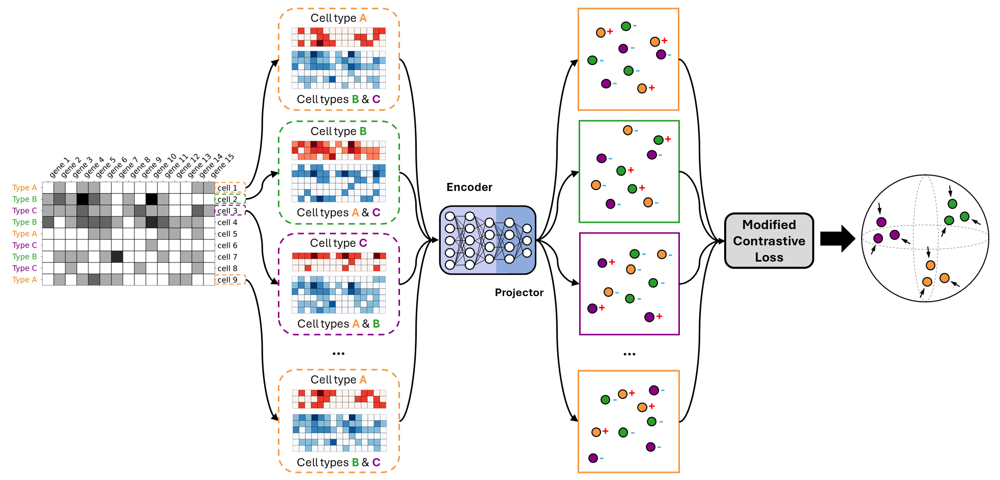

# Less is more: improving cell-type identification with augmentation-free single-cell RNA-Seq contrastive learning
This is a python implementation of the augmentation-free single-cell RNA-Seq contrastive learning method (AF-RCL) reported in:
```
@article{...,
  title={Less is more: improving cell-type identification with augmentation-free single-cell RNA-Seq contrastive learning},
  author={Alsaggaf, Ibrahim and Buchan, Daniel and Wan, Cen},
  journal={...},
  pages={...},
  year={...},
  publisher={...},
  note={Submitted for publication to [JOURNAL NAME], [SUBMISSION DATE]}
}
```

<p align="center">
  
</p>

# Usage
This repository contains the implementation of AF-RCL. The implementation is built in Python3 (version 3.10.12) using Scikit-learn and the deep learning library Pytorch. 

## Requirements
- torch==2.1.1
- scikit-learn==1.4.0

## Tutorial
We recommend running the implementation on a machine with at least 5 cores, 20 GB memory and 1 GPU. To run this implementation you need to do the following steps:
1. Make sure all the requirements stated above are installed.
2. Navigate to your working directory where the `.py` files are stored (e.g. src).
3. Execute the following command:

```
python3 main.py\
--X [full path to the genes experssion matrix]\
--y [full path to cell-types annotations]\
--name [the name of the dataset]\
--method [the name of the contrastive method (AFRCL, GsRCL, or RMCL)]\
--loss [the name of the contrastive loss function (SupCon, SimCLR, or ModifiedSupCon)]\
--top_n_genes [the top n highly variable genes (only for RMCL method)]\
--rm_dropout [the dropout rate (only for RMCL method)]\
--val_metric [the metric used for model selection (mcc, f1, or acc)]\
--train_size [the training set size when splitting the data]\
--cv [the number of cross validation folds]\
--batch_size [the batch size, to use all training samples pass the value -1]\
--epochs [the number of contrastive learning epochs]\
--step [the number of steps to measure validation performance]\
--lr [learning rate] --wd [weight decay]\
--seed [set a seed for reproducibility]\
--gpu [the gpu device number (e.g. 0)]\
--res_path [the full path where the results will be saved]
```

### Examples
To run the augmentation-free single-cell RNA-Seq contrastive learning method (**AF-RCL**) execute:
```
python3 main.py\
--X [full path to the genes experssion matrix]\
--y [full path to cell-types annotations]\
--name [the name of the dataset]\
--method AFRCL --loss ModifiedSupCon\
--val_metric mcc --train_size 0.8 --cv 5 --batch_size 64\
--epochs 500 --step 5 --lr 1e-3 --wd 1e-6 --seed 1111\
--gpu [the gpu device number (e.g. 0)]\
--res_path [the full path where the results will be saved]
```

To run the Gaussian noise-augmented single-cell RNA-Seq self-supervised contrastive learning method (**Self-GsRCL**) reported in [(Alsaggaf et al., 2024)](https://doi.org/10.1093/bfgp/elad059) execute:
```
python3 main.py\
--X [full path to the genes experssion matrix]\
--y [full path to cell-types annotations]\
--name [the name of the dataset]\
--method GsRCL --loss SimCLR\
--val_metric mcc --train_size 0.8 --cv 5 --batch_size 64\
--epochs 500 --step 5 --lr 1e-3 --wd 1e-6 --seed 1111\
--gpu [the gpu device number (e.g. 0)]\
--res_path [the full path where the results will be saved]
```

To run the Gaussian noise-augmented single-cell RNA-Seq supervised contrastive learning method (**Sup-GsRCL**) reported in [(Alsaggaf et al., 2024)](https://doi.org/10.1093/bfgp/elad059) execute:
```
python3 main.py\
--X [full path to the genes experssion matrix]\
--y [full path to cell-types annotations]\
--name [the name of the dataset]\
--method GsRCL --loss SupCon\
--val_metric mcc --train_size 0.8 --cv 5 --batch_size 64\
--epochs 500 --step 5 --lr 1e-3 --wd 1e-6 --seed 1111\
--gpu [the gpu device number (e.g. 0)]\
--res_path [the full path where the results will be saved]
```

To run the random 3000 genes masking augmentation-based self-supervised contrastive learning method (**Self-RM3000-RCL**) reported in [(Alsaggaf et al., 2024)](https://doi.org/10.1093/bfgp/elad059) execute:
```
python3 main.py\
--X [full path to the genes experssion matrix]\
--y [full path to cell-types annotations]\
--name [the name of the dataset]\
--method RMCL --loss SimCLR --top_n_genes 3000 --rm_dropout 0.9\
--val_metric mcc --train_size 0.8 --cv 5 --batch_size 64\
--epochs 500 --step 5 --lr 1e-3 --wd 1e-6 --seed 1111\
--gpu [the gpu device number (e.g. 0)]\
--res_path [the full path where the results will be saved]
```

To run the random 5000 genes masking augmentation-based supervised contrastive learning method (**Sup-RM5000-RCL**) reported in [(Alsaggaf et al., 2024)](https://doi.org/10.1093/bfgp/elad059) execute:
```
python3 main.py\
--X [full path to the genes experssion matrix]\
--y [full path to cell-types annotations]\
--name [the name of the dataset]\
--method RMCL --loss SupCon --top_n_genes 5000 --rm_dropout 0.9\
--val_metric mcc --train_size 0.8 --cv 5 --batch_size 64\
--epochs 500 --step 5 --lr 1e-3 --wd 1e-6 --seed 1111\
--gpu [the gpu device number (e.g. 0)]\
--res_path [the full path where the results will be saved]
```

### The code
Here we briefly describe each `.py` file in the **code** folder.

`main.py` Runs the selected method.

`models.py` Includes the implementation of AFRCL, GsRCL, and RMCL.

`data.py` Reads and preprocesses the given dataset.

`losses.py` Includes the modified supervised contrastive learning loss (ModifiedSupCon) along with SimCLR [(Chen et al., 2020)](http://proceedings.mlr.press/v119/chen20j.html) and SupCon [(Khosla et al., 2020)](https://proceedings.neurips.cc/paper/2020/hash/d89a66c7c80a29b1bdbab0f2a1a94af8-Abstract.html).

`networks.py` Includes the encoder architecture.

`utils.py` and `h5.py` Includes some helper functions.

# Availability
The single-cell RNA-Seq datasets (i.e. genes experssion matrices) used in this work can be downloaded from [](https://doi.org/10.5281/zenodo.8087611). The cell-type annotations for those datasets are available in the **Cell-type annotations** folder. The AF-RCL pre-trained encoders can be downloaded from .

# Acknowledgements
The authors acknowledge the support by the School of Computing and Mathematical Sciences and the Birkbeck GTA programme.
